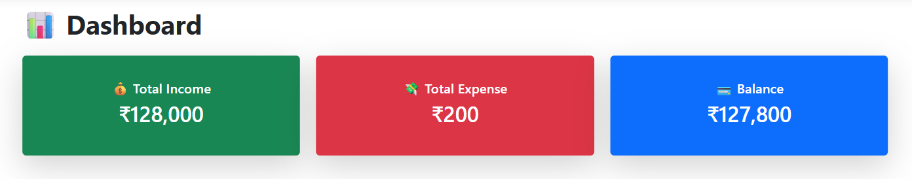
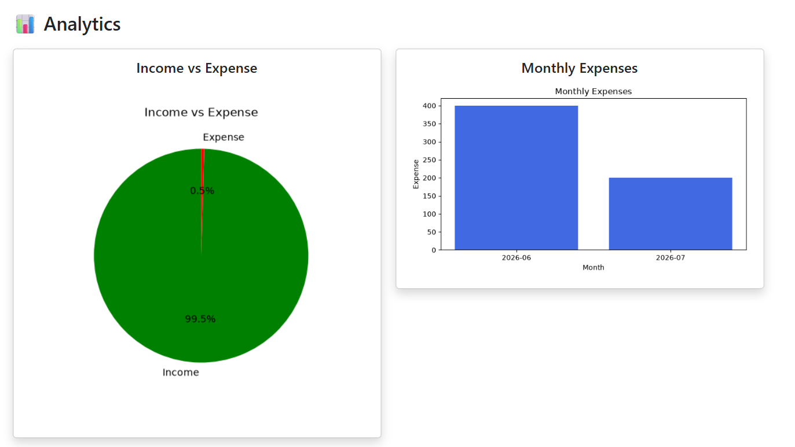

# 💰 Expense Tracker

A responsive personal finance management web application built using Flask, SQLite, Bootstrap, and Matplotlib. 

## Live Demo

🔗 Live Demo: https://expense-tracker-flask-jqvz.onrender.com

## GitHub Repository

https://github.com/rishabhbhardwaj193-prog/expense-tracker-flask

---

## Features

- Add Transactions
- Edit Transactions
- Delete Transactions
- Search Transactions
- Filter by Category
- Filter by Date
- Dashboard Summary
- Income vs Expense Pie Chart
- Monthly Expense Bar Chart
- Category Summary
- Export Transactions to CSV

---

## Technologies Used

- Python
- Flask
- SQLite
- Bootstrap 5
- Matplotlib
- HTML
- CSS

---

## Installation

```bash
git clone https://github.com/rishabhbhardwaj193-prog/expense-tracker-flask.git

cd expense-tracker-flask

pip install -r requirements.txt

python app.py
```

---

## Project Structure

```
Expense Tracker
│
├── app.py
├── database.py
├── requirements.txt
├── Procfile
├── runtime.txt
├── templates
├── static
└── README.md
```

---

## Future Improvements

- User Login
- Monthly Budget
- Dark Mode
- PDF Reports
- Recurring Expenses
- Cloud Database

---

## Screenshots

### Dashboard



### Analytics



### Add Transaction


---

## License

This project is developed for educational purposes.

## Author
Rishabh Bharadwaj
